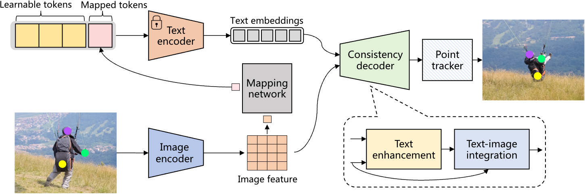

<!-- # ALTrack -->

# ALTrack: Autogenic Language Embedding for Coherent Point Tracking

<div align="center">
<br>
<a>Zikai Song</a><sup><span>1</span></sup>, 
<a>Ying Tang</a><sup><span>1</span></sup>,
<a>Run Luo</a><sup><span>1</span></sup>,
<a>Lintao Ma</a><sup><span>1</span></sup>,
<a>Junqing Yu</a><sup><span>1</span></sup>,
<a>Yi-Ping Phoebe Chen<sup><span>2</span></sup>,
<a>WeiYang<sup><span>1</span></sup>
<br>

<sup>1</sup> Huazhong University of Science and Technology <br>
<sup>2</sup> La Trobe University<br>    
*[paper](https://arxiv.org/abs/2407.20730)*
<br>
</div>


<p align="center">
    
</p>

ALTrack is a coherent point tracking framework which designes an autogenic language embedding for visual feature enhancement, strengthens point correspondence in long-term sequences. Unlike existing visual-language schemes, our approach learns text embeddings from visual features through a dedicated mapping network, enabling seamless adaptation to various tracking tasks without explicit text annotations. Additionally, we introduce a consistency decoder that efficiently integrates text tokens into visual features with minimal computational overhead.

## Code

- The Code will be released soon!

## Citation

If you find this repo useful for your research, please consider citing the paper

```
@inproceedings{song2024altrack,
  title={Autogenic Language Embedding for Coherent Point Tracking},
  author={Song, Zikai and Tang, Ying and Luo, Run and Ma, Lintao and Yu, Junqing and Chen, Yi-Ping Phoebe and Yang, Wei},
  booktitle={Proceedings of the 29th ACM International Conference on Multimedia},
  year={2024}
}
```

<!--## Acknowledgement

We would like to thank the following repos for their great work:

- This work is built upon the[CoTracker]([https://github.com/OpenGVLab/MM-Interleaved](https://github.com/facebookresearch/co-tracker))
 -->
